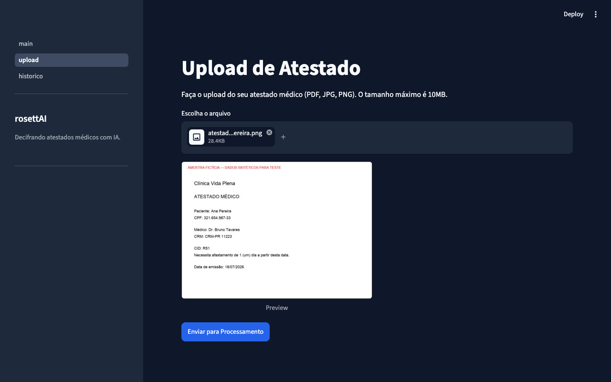
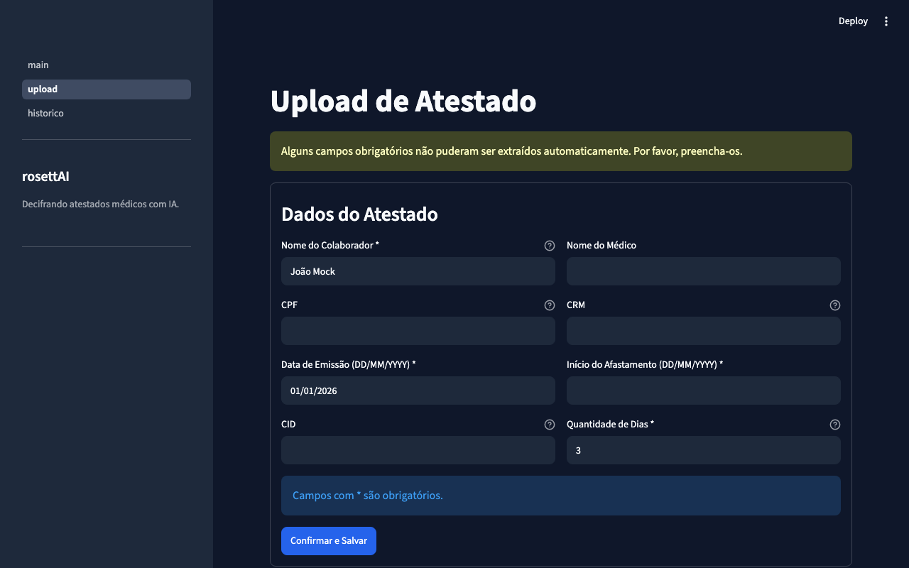
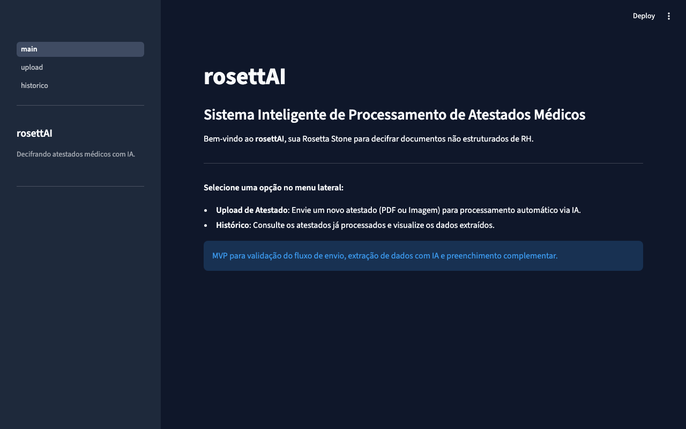
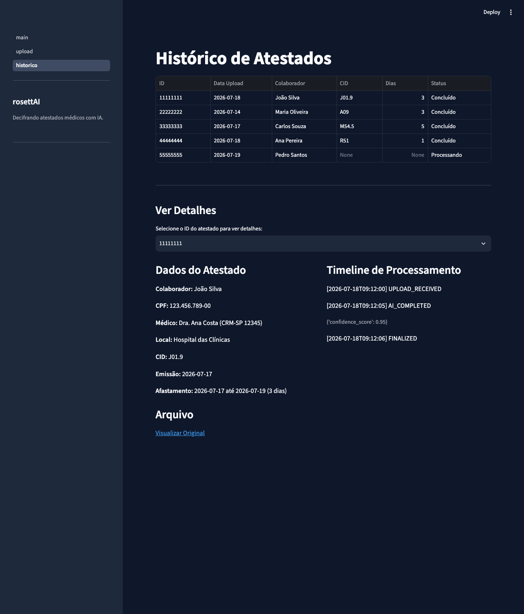

# rosettAI

> **Por que "rosettAI"?** — Assim como a [Pedra de Rosetta](https://pt.wikipedia.org/wiki/Pedra_de_Roseta) permitiu decifrar hieróglifos ao traduzir uma mesma mensagem entre línguas diferentes, o **rosettAI** decifra atestados médicos — documentos não estruturados, escritos em formatos variados e muitas vezes ilegíveis — e os traduz para dados estruturados que o RH consegue entender e analisar. É a sua **Rosetta Stone** turbinada por IA.

---

## Sobre o Projeto

Sistema inteligente de processamento de atestados médicos que utiliza **IA generativa (Gemini)** para extrair automaticamente informações de documentos médicos, estruturá-las e armazená-las em banco de dados, eliminando digitação manual e reduzindo erros.

Este é um **MVP / prova de conceito**: um único analista de RH faz os uploads, os documentos e dados usados em demonstração são fictícios, e algumas decisões de escopo abaixo refletem isso propositalmente.

### O Problema

| Desafio atual | Solução rosettAI |
|---|---|
| Documentos em formatos variados (PDF, foto, scan) | Upload unificado com suporte a PDF, JPG e PNG |
| Digitação manual propensa a erros | Extração automática via IA multimodal |
| Baixa rastreabilidade | Auditoria completa com timestamps e eventos |
| Dificuldade para gerar indicadores | Dados estruturados prontos para analytics |

---

## Capturas de Tela

| Upload — antes do envio | Upload — complementação manual |
|---|---|
|  |  |

| Página inicial | Histórico com detalhes do atestado |
|---|---|
|  |  |

> Telas geradas com dados fictícios (ver [docs/demo_guide.md](docs/demo_guide.md) e `scripts/generate_demo_assets.py`) — nenhum atestado real foi usado.

---

## Arquitetura

```
Colaborador → Streamlit UI → Upload arquivo
                                  ↓
                          Supabase Storage
                                  ↓
                           Gemini API (IA)
                                  ↓
                         JSON Estruturado
                          ↙            ↘
                Dados completos    Dados faltantes
                      ↓                  ↓
                      ↓          Formulário complementar
                      ↓                  ↓
                      ↘                ↙
                  PostgreSQL (Supabase)
                          ↓
                  SQL / Dashboards
```

## Tech Stack

| Componente | Tecnologia |
|---|---|
| Interface | Streamlit |
| Hospedagem | Render |
| IA | Google Gemini API (multimodal) |
| Banco de Dados | Supabase (PostgreSQL) |
| Storage | Supabase Storage |
| Linguagem | Python 3.12+ |
| Controle de versão | GitHub |

---

## Estrutura do Projeto

```
rosettAI/
├── app/
│   ├── main.py                  # Ponto de entrada Streamlit
│   ├── config.py                # Configurações e variáveis de ambiente
│   ├── components.py            # Branding compartilhado (sidebar)
│   ├── pages/
│   │   ├── 01_upload.py         # Página de upload de atestados
│   │   └── 02_historico.py      # Página de histórico/consulta
│   ├── services/
│   │   ├── gemini_service.py    # Integração com Gemini API
│   │   ├── storage_service.py   # Upload/download Supabase Storage
│   │   └── database_service.py  # CRUD PostgreSQL
│   ├── models/
│   │   └── schemas.py           # Modelos de dados (Pydantic)
│   └── utils/
│       ├── validators.py        # Validações de campos obrigatórios
│       └── date_utils.py        # Parsing de datas (DD/MM/YYYY)
├── sql/
│   ├── create_schema.sql        # DDL das tabelas
│   ├── insert_demo_data.sql     # Dados de teste
│   └── analytics_queries.sql    # Queries analíticas
├── tests/
│   ├── test_gemini_service.py
│   ├── test_validators.py
│   └── test_date_utils.py
├── scripts/
│   └── generate_demo_assets.py  # Gera atestados fictícios para testar o upload
├── demo_assets/                 # Imagens de atestado fictícias (geradas pelo script acima)
├── docs/
│   ├── PRD_Sistema_Inteligente_Atestados_MVP.md
│   ├── demo_guide.md            # Roteiro de demonstração para o time de RH
│   ├── TUTORIAL_PROXIMOS_PASSOS.md  # Passo a passo do que depende do responsável pelo projeto
│   └── screenshots/             # Capturas de tela usadas neste README
├── .env.example                 # Template de variáveis de ambiente
├── .python-version              # Versão do Python fixada (3.12)
├── .pre-commit-config.yaml      # Hook local de detect-secrets
├── .streamlit/config.toml       # Configuração visual Streamlit
├── requirements.txt
├── requirements-dev.txt         # Ferramentas de dev (pre-commit, detect-secrets)
├── Procfile                     # Deploy Render
├── render.yaml                  # Blueprint do Render (secrets ficam sync:false — nunca no repo)
├── LICENSE
└── README.md
```

---

## Setup Local

### Pré-requisitos

- Python 3.12+ (fixado em `.python-version`)
- Conta no [Supabase](https://supabase.com) (projeto criado)
- Chave de API do [Google Gemini](https://ai.google.dev)

### Instalação

```bash
# Clone o repositório
git clone git@github.com:pmusachio/rosettAI.git
cd rosettAI

# Crie o ambiente virtual (use a versão do Python fixada em .python-version)
python3.12 -m venv .venv
source .venv/bin/activate  # Linux/Mac
# .venv\Scripts\activate   # Windows

# Instale as dependências
pip install -r requirements.txt

# Opcional (recomendado): ferramentas de dev + proteção contra commit de secrets
pip install -r requirements-dev.txt
pre-commit install

# Configure as variáveis de ambiente
cp .env.example .env
# Edite o .env com suas credenciais
```

> Sem `GEMINI_API_KEY`/credenciais Supabase configuradas, os serviços caem em
> modo mock (dados fictícios, sem gravação real) — dá para navegar pela
> interface localmente antes de ter as credenciais reais. Veja o passo a
> passo completo de criação de conta/credenciais em
> [docs/TUTORIAL_PROXIMOS_PASSOS.md](docs/TUTORIAL_PROXIMOS_PASSOS.md).

### Variáveis de Ambiente

```env
GEMINI_API_KEY=sua_chave_gemini
GEMINI_MODEL=gemini-3.5-flash
SUPABASE_URL=https://seu-projeto.supabase.co
SUPABASE_KEY=sua_chave_anon
SUPABASE_SERVICE_KEY=sua_chave_service
```

> `GEMINI_MODEL` é opcional (tem um padrão em `app/config.py`), mas existe
> como variável separada porque a Google tem restringido/descontinuado
> modelos do Gemini com pouco aviso, inclusive para chaves recém-criadas. Se
> o upload falhar com `404 NOT_FOUND ... no longer available`, troque esse
> valor por um modelo atual (confira em [ai.google.dev/gemini-api/docs/models](https://ai.google.dev/gemini-api/docs/models))
> sem precisar alterar código nem fazer novo deploy.

### Executando

```bash
streamlit run app/main.py
```

> Rode isso no mesmo terminal onde ativou o `.venv` (`source .venv/bin/activate`).
> Se abrir uma aba/janela nova, o `.venv` não fica ativado automaticamente —
> `which streamlit` deve apontar para `.venv/bin/streamlit`; se apontar para
> outro lugar (ex: um Streamlit global instalado fora do projeto), você verá
> `ModuleNotFoundError` para as dependências do projeto. Nesse caso, ative o
> `.venv` de novo ou rode direto `.venv/bin/streamlit run app/main.py`.

### Testes

```bash
pytest
```

---

## Modelo de Dados

### `documents` — Controle de arquivos

| Campo | Tipo | Descrição |
|---|---|---|
| id | UUID | Chave primária |
| file_name | VARCHAR | Nome original do arquivo |
| file_url | TEXT | URL no Supabase Storage |
| uploaded_at | TIMESTAMP | Data/hora do upload |
| accepted_at | TIMESTAMP | Data/hora de aceite |
| document_issue_date | DATE | Data de emissão do atestado |
| processing_status | VARCHAR | pending / processing / completed / error |
| created_at | TIMESTAMP | Criação do registro |
| updated_at | TIMESTAMP | Última atualização |

### `medical_certificates` — Dados extraídos

| Campo | Tipo | Descrição |
|---|---|---|
| id | UUID | Chave primária |
| document_id | UUID | FK → documents |
| employee_name | VARCHAR | Nome do colaborador |
| employee_cpf | VARCHAR | CPF |
| doctor_name | VARCHAR | Nome do médico |
| crm | VARCHAR | CRM do médico |
| health_facility | VARCHAR | Estabelecimento de saúde |
| cid | VARCHAR | Código CID |
| issue_date | DATE | Data de emissão |
| leave_start_date | DATE | Início do afastamento |
| leave_end_date | DATE | Fim do afastamento |
| leave_days | INTEGER | Dias de afastamento |
| document_type | VARCHAR | Tipo do documento |

### `processing_events` — Auditoria

| Campo | Tipo | Descrição |
|---|---|---|
| id | UUID | Chave primária |
| document_id | UUID | FK → documents |
| event_type | VARCHAR | Tipo do evento |
| timestamp | TIMESTAMP | Data/hora |
| details | JSONB | Detalhes adicionais |

**Eventos rastreados:** `UPLOAD_RECEIVED` → `AI_STARTED` → `AI_COMPLETED` → (`USER_COMPLEMENTED`) → `FINALIZED`, ou `ERROR` em caso de falha na IA/Storage/banco.

---

## Decisões de Escopo e Arquitetura

- **Prazo de envio é responsabilidade do ADP, não do rosettAI.** O sistema ADP da empresa já classifica envios como dentro do prazo ou retroativo. O rosettAI apenas captura e armazena as datas (`document_issue_date`, `issue_date`, `leave_start_date`, `leave_end_date`) — qualquer sistema de RH pode aplicar suas próprias regras sobre elas.
- **Banco/Storage ficam no Supabase, não SQLite.** O deploy é no Render, cujo disco é efêmero (reseta a cada deploy/restart) a menos que se contrate um disco persistente. SQLite perderia dados silenciosamente nesse ambiente; o Supabase (free tier) já resolve banco + storage sem esse risco. Revisitar apenas se o compute migrar para algo com disco persistente.
- **Deploy continua no Render nesta fase do MVP.** Google Cloud (Cloud Run) e BigQuery só entram em cena se a empresa decidir comprar a solução — não fazem parte do escopo atual.
- **Controle de acesso (login) fica fora de escopo por enquanto**, já que apenas o analista de RH usa a aplicação nesta primeira fase. Isso é diferente de segurança de secrets/API keys, que continua obrigatória porque o *código-fonte* é público no GitHub: nunca comitar `.env`; chaves reais são preenchidas manualmente no painel do Render (`sync: false` no `render.yaml`); e há um hook local de `detect-secrets` via `pre-commit` para pegar isso antes do commit.

---

## Documentação adicional

- [PRD](docs/PRD_Sistema_Inteligente_Atestados_MVP.md) — objetivo, escopo e regras de negócio
- [TASKS.md](TASKS.md) — backlog detalhado por épico, com status real de cada item
- [docs/demo_guide.md](docs/demo_guide.md) — roteiro para demonstrar o MVP ao time de RH
- [docs/TUTORIAL_PROXIMOS_PASSOS.md](docs/TUTORIAL_PROXIMOS_PASSOS.md) — passo a passo de tudo que depende de conta/credenciais do responsável pelo projeto (Supabase, Gemini, deploy no Render)

---

## Status do Projeto

**Em desenvolvimento** — MVP. URL de produção: *a definir após o deploy no Render (ver [docs/TUTORIAL_PROXIMOS_PASSOS.md](docs/TUTORIAL_PROXIMOS_PASSOS.md)).*

---

## Licença

Este projeto está licenciado sob a licença MIT — veja o arquivo [LICENSE](LICENSE) para detalhes.
